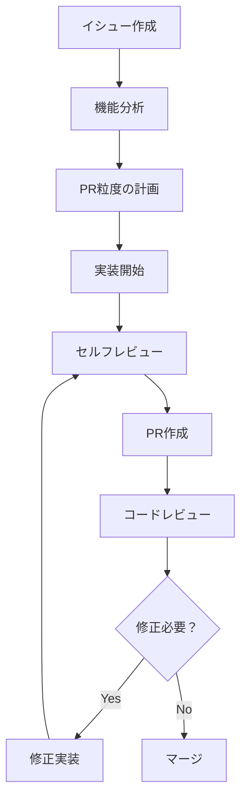

## はじめに

開発チームでPull Request（PR）を運用していると、しばしば議論になるのがPRの粒度です。「一つのPRでどこまでの変更を含めるべきか？」という問題は、チームの生産性やコードの品質に直結する重要な課題です。

特に生成AIの活用が一般的になった現在、従来の開発フローとは異なる課題も生まれています。AIが大量のコードを短時間で生成できるようになった結果、PRのサイズが肥大化しやすくなり、レビュアーの負担が増大するケースも見受けられます。

本記事では、効率的なコードレビューと開発スピードの両立を目指すPRの粒度について、実体験を交えながら考察していきます。

## とにかく小さく

**「PRは可能な限り小さくする」** - これは多くの開発チームで共有されているベストプラクティスです。しかし、「小さく」とは具体的にどの程度を指すのでしょうか？

### 小さなPRのメリット

1. **レビュー時間の短縮**
   - 変更行数が少ないため、レビュアーが内容を把握しやすい
   - 集中力を維持してレビューできる（推奨：200-400行以下）

2. **バグの早期発見**
   - 変更範囲が限定的なため、問題の原因を特定しやすい
   - テストケースも絞り込みやすい

3. **マージ競合の回避**
   - 同じファイルを複数人が同時に編集するリスクが減る
   - 短期間でマージされるため、競合が発生しにくい

4. **ロールバックの容易さ**
   - 問題が発生した際、影響範囲を限定してロールバックできる

### 実践的な分割例

```typescript
// ❌ 悪い例：一つのPRで複数の機能を実装
// PR: "ユーザー管理機能の実装"
// - ユーザー登録API
// - ユーザー一覧表示
// - ユーザー削除機能
// - バリデーション機能
// - テストコード
// 合計: 800行の変更

// ✅ 良い例：機能ごとにPRを分割
// PR1: "ユーザーモデルの定義" (50行)
// PR2: "ユーザー登録APIの実装" (120行)
// PR3: "ユーザー一覧表示の実装" (80行)
// PR4: "ユーザー削除機能の実装" (100行)
```

## 生成AIとPRサイズの関係

### AI生成コードの特徴と課題

生成AIを活用した開発では、従来とは異なる課題が生まれています：

1. **大量コード生成の罠**
   ```bash
   # AIに「ECサイトのユーザー管理システムを作って」と依頼
   # 結果：一度に500-1000行のコードが生成される
   # → レビュアーの負担が急増
   ```

2. **コンテキスト不足の問題**
   - AIが生成したコードの意図や設計思想がレビュアーに伝わりにくい
   - なぜその実装を選択したのかの背景が不明

3. **品質のばらつき**
   - 生成されたコードの品質が一定でない
   - セキュリティやパフォーマンスの観点が抜け落ちる可能性

### AI活用時のPR戦略

```markdown
## 推奨アプローチ

1. **段階的な実装**
   - Step1: データモデルの定義（AI生成 + 手動調整）
   - Step2: API仕様の実装（AI生成 + レビュー）
   - Step3: フロントエンド実装（AI生成 + UI/UX調整）

2. **コンテキスト情報の充実**
   - PRの説明にAIプロンプトを記載
   - 生成されたコードの修正箇所とその理由を明記
   - 実装方針や制約条件を詳細に記述
```

## 機能単位での分割戦略

### 縦割りvs横割り

**縦割り（機能単位）**
```
PR1: ユーザー登録機能（フロント〜バック〜DB）
PR2: ユーザー一覧機能（フロント〜バック〜DB）
PR3: ユーザー編集機能（フロント〜バック〜DB）
```

**横割り（レイヤー単位）**
```
PR1: データベーススキーマの定義
PR2: APIエンドポイントの実装
PR3: フロントエンド画面の実装
```

### どちらを選ぶべきか？

**縦割りが適している場合：**
- 機能が独立している
- エンドツーエンドでのテストが重要
- チームメンバーがフルスタックで対応可能

**横割りが適している場合：**
- レイヤー間の依存関係が複雑
- 専門性が分かれている（フロント/バック担当者が異なる）
- 基盤部分の変更が多い

## レビュー効率を上げるコツ

### 1. セルフレビューの徹底

```bash
# PRを作成する前に必ず実行
git diff --name-only HEAD~1  # 変更ファイルの確認
git diff HEAD~1              # 具体的な変更内容の確認

# チェックポイント
# - 不要なファイルが含まれていないか？
# - コメントアウトされたコードが残っていないか？
# - デバッグ用のconsole.logが残っていないか？
```

### 2. PR説明の標準化

```markdown
## PR Template Example

### 変更概要
- 何を変更したか（1-2行で簡潔に）
CodeRabbitのようなAIツールを使うと、生成されたコードの概要を自動で生成することも可能ですので、AIにお任せしまったほうが良いかも知れません。

### 変更理由
- なぜその変更が必要だったか

### 影響範囲
- どのモジュール/機能に影響するか
- 破壊的変更の有無

### テスト方法
- 動作確認の手順
- 追加したテストケース

### スクリーンショット（UI変更の場合）
- Before/After画像

### レビューポイント
- 特に注意して見てほしい箇所
```

### 3. ドラフトPRの活用

```markdown
## ドラフトPR活用例

1. **設計相談段階**
   - [Draft] 実装方針について相談
   - インターフェースの定義のみをレビュー

2. **進捗共有段階**
   - [Draft] WIP: ユーザー登録機能実装中
   - 実装途中での方向性確認

3. **最終確認段階**
   - Ready for Review に変更
   - 正式なコードレビュー開始
```

## チーム運用における実践例

### 実際のワークフロー例



### チーム内でのルール設定例

```yaml
# team-pr-guidelines.yml
pr_size_limits:
  small: "< 100 lines"      # 優先的にレビュー
  medium: "100-400 lines"   # 通常のレビュー
  large: "400-500 lines"    # 事前相談必須
  xl: "> 500 lines"         # 原則認めない（ファイルの移動などは可）

review_requirements:
  small: 1人以上
  medium: 2人以上  
  large: チームリード必須
  
response_time_sla:
  small: 4時間以内
  medium: 8時間以内
  large: 1営業日以内
```

## まとめ

効果的なPR粒度の実現には、以下の点が重要です：

1. **原則は「小さく、早く」**
   - 機能単位での分割を基本とする
   - レビュー負荷を常に意識する

2. **生成AI時代への適応**
   - AI生成コードも段階的に実装
   - コンテキスト情報の充実が必須

3. **チーム文化の醸成**
   - PR作成者とレビュアー双方の負荷軽減
   - 継続的な改善とフィードバック

生成AIの普及により開発スピードは向上していますが、品質を担保するためのコードレビューの重要性はむしろ高まっています。適切なPR粒度の設定により、開発効率と品質の両立を目指していきましょう。