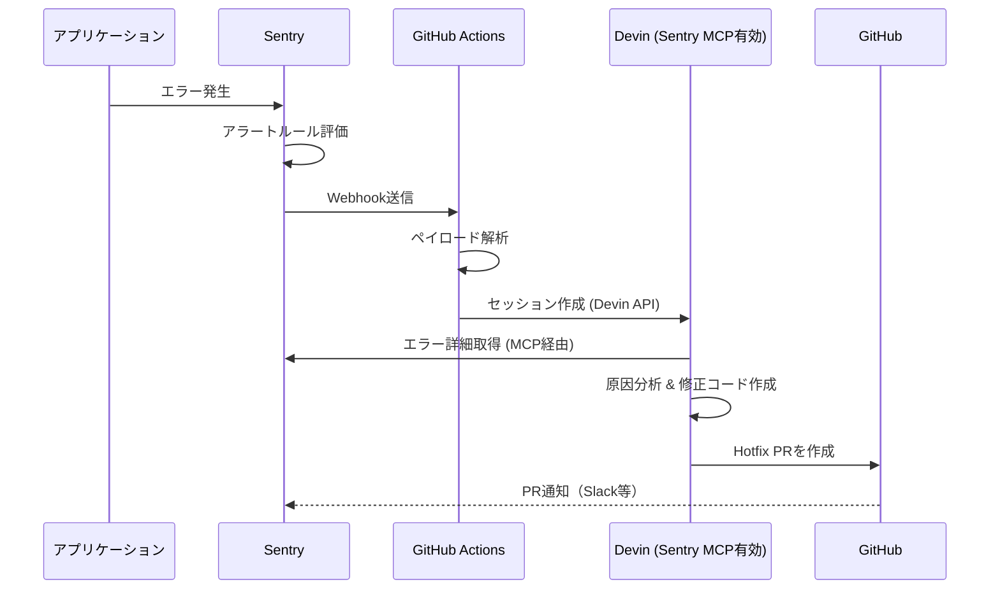

## はじめに

昨年のDevin 1st Aniversaryのスライドを記事にしてみました。
ClaudeCodeがむちゃくちゃ優秀なのでDevinは普段の開発に使わない（根が貧乏人なので使えない）にもかかわらず、
毎月このためだけにCoreプランのクレジットを積み立てていたりします。

GithubActionのWorkflowにClaudeCodeを配置して同じようなことが実現できなくもないのですが、GithubActionのWorkflow上だとSentryのMCPが使えないのでどうしてもスタックトレースとの距離が長くなってしまいます。

ですので、最初のHotfix作成はやはり2026/03の今でもDevinが筆頭候補となるはずです。

## アーキテクチャ概要

全体のフローは以下の通りです。



ポイントは、DevinがSentry MCPサーバーを通じて直接Sentryのエラー情報（スタックトレース、ブレッドクラム、コンテキスト）を取得できることです。これにより、Webhookで受け取った情報だけでなく、Devinが自らSentryを深掘りして調査でき、人間が介在せずにhotfixを作成することが可能です。

## 前提条件

- **Sentry**: Business Plan以上（Internal Integration + Webhookを利用）
- **Devin**: Team Plan（API利用に必要、$500/月〜）
- **GitHub Actions**: リポジトリでの利用権限
- **DevinのSentry MCP**: Devin Settings > MCP Marketplace で有効化済み

## Sentry MCP Serverとは

Sentry MCP Serverは、Sentryが公式に提供するMCP（Model Context Protocol）サーバーです。AIエージェントがSentryのデータに直接アクセスできるようになります。

DevinではMCP Marketplaceから「Sentry」を有効化するだけで、セッション内からこれらのツールを利用できます。自前でMCPサーバーを立てる必要はありません。

### 3. GitHub Actionsのトリガー設定

SentryのWebhookを直接GitHub Actionsで受け取るには、中継サーバーが必要です。ここでは簡易的に、Sentry Webhook → 中継（Cloudflare Workers等）→ GitHub `repository_dispatch` という構成を取ります。

中継Workerの例：

```typescript
export default {
  async fetch(request: Request, env: Env): Promise<Response> {
    if (request.method !== "POST") {
      return new Response("Method not allowed", { status: 405 });
    }

    const body = await request.json();
    const action = body.action;
    const data = body.data;

    // Sentry issue webhookの場合
    if (action === "created" && data?.issue) {
      const issueId = data.issue.id;
      const title = data.issue.title;
      const project = data.issue.project?.slug;

      await fetch(
        `https://api.github.com/repos/${env.GITHUB_OWNER}/${env.GITHUB_REPO}/dispatches`,
        {
          method: "POST",
          headers: {
            Authorization: `Bearer ${env.GITHUB_TOKEN}`,
            Accept: "application/vnd.github.v3+json",
          },
          body: JSON.stringify({
            event_type: "sentry-issue",
            client_payload: {
              issue_id: issueId,
              title: title,
              project: project,
            },
          }),
        }
      );
    }

    return new Response("OK", { status: 200 });
  },
};
```

## GitHub Actionsワークフロー実装

`.github/workflows/sentry-devin-hotfix.yml` として以下を作成します：

```yaml
name: Sentry Auto Hotfix with Devin

on:
  repository_dispatch:
    types: [sentry-issue]

jobs:
  auto-hotfix:
    runs-on: ubuntu-latest
    permissions:
      contents: read
      pull-requests: write
      issues: write
    env:
      DEVIN_API_KEY: ${{ secrets.DEVIN_API_KEY }}
      GITHUB_TOKEN: ${{ secrets.GITHUB_TOKEN }}
    steps:
      - uses: actions/checkout@v4
        with:
          fetch-depth: 0

      - name: Install jq
        run: |
          if ! command -v jq &>/dev/null; then
            sudo apt-get update && sudo apt-get install -y jq
          fi

      - name: Parse Sentry payload
        id: sentry
        run: |
          echo "issue_id=${{ github.event.client_payload.issue_id }}" >> "$GITHUB_OUTPUT"
          echo "title=${{ github.event.client_payload.title }}" >> "$GITHUB_OUTPUT"
          echo "project=${{ github.event.client_payload.project }}" >> "$GITHUB_OUTPUT"

      - name: Create Devin hotfix session
        run: |
          # 指示内容を読み込む
          instructions=$(cat .github/devin_hotfix_instructions.md)

          prompt="以下のSentryエラーを調査し、hotfix PRを作成してください。

          ## エラー情報
          - Sentry Issue ID: ${{ steps.sentry.outputs.issue_id }}
          - タイトル: ${{ steps.sentry.outputs.title }}
          - プロジェクト: ${{ steps.sentry.outputs.project }}
          - リポジトリ: ${{ github.repository }}

          ## 手順
          1. Sentry MCPを使って上記Issue IDのエラー詳細（スタックトレース、ブレッドクラム）を取得してください
          2. 根本原因を分析してください
          3. 修正コードを作成し、hotfix PRを出してください

          ${instructions}"

          escaped_prompt=$(echo "$prompt" | jq -Rs .)

          response=$(curl -s -w "\n%{http_code}" -X POST "https://api.devin.ai/v1/sessions" \
            -H "Authorization: Bearer $DEVIN_API_KEY" \
            -H "Content-Type: application/json" \
            -d "{\"prompt\": $escaped_prompt}")

          http_status=$(echo "$response" | tail -n 1)
          echo "Devin API status: $http_status"

          if [ "$http_status" -ne 200 ]; then
            echo "::error::Devin API call failed with status $http_status"
            echo "$response" | sed '$d'
            exit 1
          fi

          http_body=$(echo "$response" | sed '$d')
          session_id=$(echo "$http_body" | jq -r '.session_id')
          session_url=$(echo "$http_body" | jq -r '.url')

          if [ -z "$session_id" ] || [ "$session_id" = "null" ]; then
            echo "::error::Failed to get Devin session ID"
            exit 1
          fi

          echo "Devin session created: $session_id"
          echo "Session URL: $session_url"

          # Issueにコメントを残す（トラッキング用）
          gh issue create \
            --title "🤖 Auto Hotfix: ${{ steps.sentry.outputs.title }}" \
            --body "Sentry Issue ID: \`${{ steps.sentry.outputs.issue_id }}\`

          Devinが自動でhotfixを作成中です。

          - **Devin Session**: $session_url
          - **Sentry Project**: \`${{ steps.sentry.outputs.project }}\`
          - **Triggered at**: $(date -u '+%Y-%m-%d %H:%M:%S UTC')

          > ⚠️ このIssueはSentryアラートから自動作成されました。Devinが作成するPRをレビューしてください。" \
            --label "auto-hotfix"
```

## Devinへの指示ファイル

`.github/devin_hotfix_instructions.md` として以下を作成します：

```markdown
# Hotfix作成の指示

## 言語
- コミットメッセージ、PRの説明は日本語で書くこと。
- コード内のコメントは既存コードの言語に合わせること。

## 調査手順
1. Sentry MCPを使い、該当Issueの詳細情報を取得する
2. スタックトレースから該当ファイル・行番号を特定する
3. ブレッドクラムから再現手順を推測する
4. 可能であればSeerの根本原因分析も参照する

## 修正方針
- 最小限の変更に留めること（hotfixであることを意識）
- 既存のテストが壊れないことを確認すること
- 新しいテストを追加する場合は、再発防止に直結するものに限ること
- パフォーマンスに影響しない変更であることを確認すること

## ブランチ・PR作成
- ブランチ名: `hotfix/sentry-{issue_id}-{簡潔な説明}`
- PRタイトル: `🚑 [Hotfix] {エラーの簡潔な説明}`
- PR本文に以下を含めること:
  - Sentry Issue IDとリンク
  - 原因の説明
  - 修正内容の説明
  - 影響範囲の説明
- PRに `auto-hotfix` ラベルを付与すること
- draft PRとして作成すること（人間のレビュー必須）

## 修正が困難な場合
- 原因が複雑で自動修正が難しい場合は、PRを作成せず調査結果だけをまとめること
- 調査結果はGitHub Issueにコメントとして残すこと
- 「自動修正は困難」と明記し、推奨する対応方針を記載すること

## やってはいけないこと
- 本番環境に直接デプロイしないこと
- マージは絶対にしないこと（人間が確認してマージする）
- 依存パッケージのバージョンを変更しないこと
- 設定ファイル（環境変数等）を変更しないこと
```

## 動作パターン

### パターン1: Devinが自動修正できるケース

1. アプリでエラー発生 → Sentryがキャッチ
2. アラートルールに合致 → Webhookが発火
3. GitHub Actions起動 → Devinセッション作成
4. DevinがSentry MCPでエラー詳細を取得
5. 原因特定 → 修正コード作成 → **draft PRを作成**
6. GitHub Issueにセッションリンクを記録
7. 翌朝、エンジニアがPRをレビューしてマージ

### パターン2: 自動修正が困難なケース

1. 〜4. は同じ
5. Devinが「自動修正は困難」と判断
6. 調査結果（原因分析、影響範囲、推奨対応）をIssueにコメント
7. 翌朝、エンジニアが調査結果をもとに対応

どちらのパターンでも、翌朝エンジニアが対応を始める時点で「何が起きたのか」「原因は何か」が整理されている状態を作れるのが大きなメリットです。

## 注意点・制限事項

### コスト

| 項目 | コスト |
|------|--------|
| Devin Team Plan | $500/月〜 |
| Devin ACU消費 | セッションごとに消費（調査の深さに依存） |
| Sentry Business Plan | プランに応じた料金 |
| Cloudflare Workers | 無料枠で十分（リクエスト数が少ないため） |

ACUの消費を抑えるため、アラートルールのフィルタ条件は適切に絞り込むことを推奨します。例えば「同じエラーが5分以内に10回以上発生」のような条件にすることで、ノイズによる無駄なセッション起動を防げます。

### 安全性

- Devinが作成するPRは必ず **draft PR** にしています。人間のレビューなしにマージされることはありません
- 依存パッケージや設定ファイルの変更は指示で明確に禁止しています
- `auto-hotfix` ラベルにより、自動生成されたPRであることが一目で分かります

### 精度

- すべてのエラーをDevinが修正できるわけではありません。体感で**簡単なバグの6〜7割**程度は修正PRを出してくれます
- 複雑なロジックバグや、再現条件が特殊なケースは調査結果のまとめに留まることが多いです
- それでも「原因調査済み＋影響範囲の整理済み」の状態から対応を始められるのは大きい

## まとめ

Sentry MCP × Devin APIの組み合わせにより、夜中の障害対応フローを大幅に改善できました。

- **エンジニアの睡眠を守れる**: 深夜のアラート対応から解放される
- **初動が速い**: エラー発生から数分でDevinが調査を開始する
- **翌朝すぐ動ける**: 出社時にはhotfix PRか調査レポートが準備済み

もちろん、完全な自動化ではなく「人間のレビューを前提としたアシスト」という位置づけです。しかし、夜中に叩き起こされて眠い頭でスタックトレースを読む苦行からは確実に解放されます。

オンコール対応に疲弊しているチームはぜひ試してみてください。