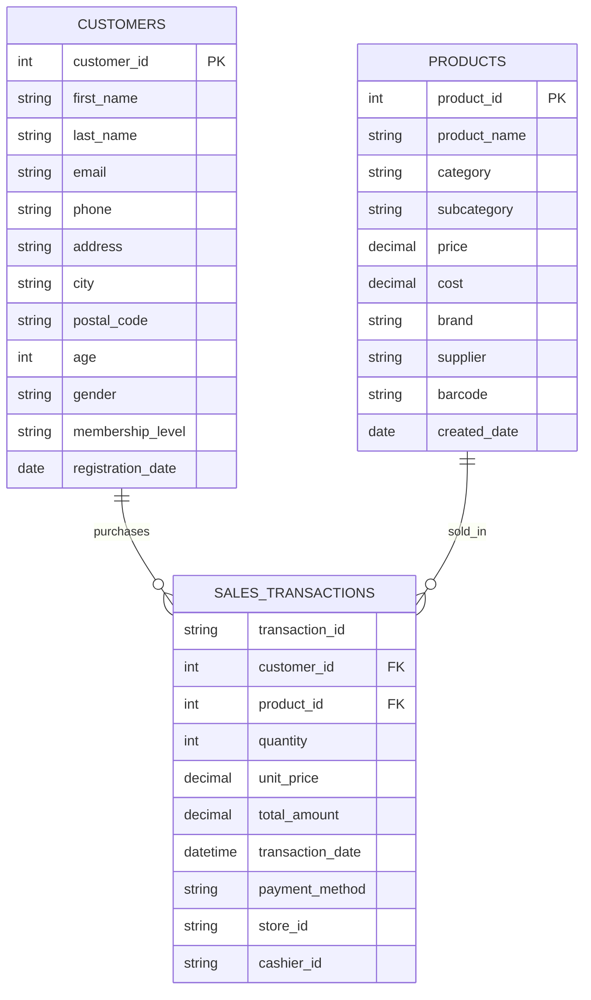

## はじめに

このチュートリアルはすべてDocker環境で行うためローカル環境を汚染しません。
最初のベースとなるファイルのみレポジトリに配置されているので、それらをどんどんと変換していくのがこのチュートリアルの基本的な流れとなっています。

また、dbtに用いるOLAPDBとしてDuckDBを使用しています。
今回はDuckDBの中身まで言及はしませんが、SQLiteのOLAPDB版とざっくり捉えていただいて構いません。
SQLiteのようにサーバを立ち上げなくてもファイルベースで管理できるとても優れたDBです。
wasmで実装されたWebGUIがあるなど、とてもイケているDBなので興味があったら深ぼっていただいても良いかもしれません。私もSnowflakeとDuckDBのハイブリット構成でコスト最適化ができないか日々考えています。

まずは下記のレポジトリよりDockerおよびSeedファイルをCloneしてきましょう。

```bash
git clone https://github.com/yo4raw/dbt-tutorial
```

Dockerfileとcompose.ymlはよくありがちな構成なので特に解説はしませんが、ご確認いただきたいのはseedsの中にある4ファイルです。

今回seedデータとして準備した3ファイルと、それらの内容を記載したschema.ymlの4つで構成されています。




  関連性の説明:
  - CUSTOMERS と
  SALES_TRANSACTIONS:
  1対多の関係（1人の顧客が複
  数回購入可能）
  - PRODUCTS と
  SALES_TRANSACTIONS:
  1対多の関係（1つの商品が複
  数回販売可能）
  - SALES_TRANSACTIONSがファ
  クトテーブル、CUSTOMERSとPR
  ODUCTSがディメンションテー
  ブルの構造

  この構造をまずは把握していただいたうえで早速チュートリアルに入っていきましょう！